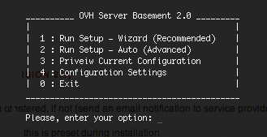

OVH Server Basement
===================

URL: http://ovhserverbasement.co.za/

OVH Server Basement simply helps you configure your webserver (i.e. Apache) virtual hosts, point and direct them to your desired './www' folder with sample working PHP, HTML, CSS & JavaScript files automatically linked together and ready for one to start developing their system.

These usually are series of steps under-taken right after operating system installation (in this case Ubuntu), Obtaining of a public IP Address ususally static then Webserver & Database.

OVH Server Basement does the following:
--
1. Setup Apache Virtual Hosts by appending newly created domains records into your default /etc/apache2/sites-available/ file.
2. Create the chosen domain name folder inside the server '/var/www' folder on a physical drive
    i.e. './www/yourdomainname/' & '/var/www/yourdomainname/html/'
3. Auto-Prepares your PHP environment - '/var/www/yourdomainname/html/index.php'
4. Auto-Prepares your HTML environment - '/var/www/yourdomainname/html/index.html'
5. Auto-Prepares your CSS & JAVASCRIPT environment - these also get linked, imported or included into your HTML and PHP index files
    '/var/www/yourdomainname/html/styles/styles.css'
    '/var/www/yourdomainname/html/js/js.js'
6. Auto-Create the the backup folder for the above '/var/www/yourdomainname/' - this gets created under the user's home directory
    i.e. '/var/home/username/bacup/yourdomainname/'
7. Add this into the cronjob so it can be backed up every night at 12h00

Version
=======
- 2018 - v2.0.2
- 2017 - v2.0
- 2016 - v1.0
