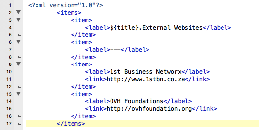
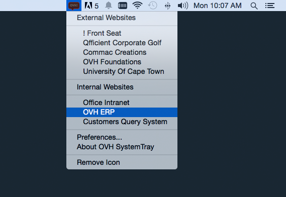

**OVH SystemTray **
===
OVH SystemTray is a FREE customizable desktop utility system tray that takes away the painful job of having to memorize and type URL address for different domain names that you use in a daily bases at your work place.

You get to organize your URLs and group them as well as order them in a manner you want depending on how often you get to access them.

Steps on how to specify xml menu file:
===
1. Click on OVH SystemTray icon
2. then Go to "Preferences..." menu
3. Select "XML Path" tab on OVH SystemTray Preference window
4. Lastly, add XML path and press save then re-start OVH SystemTray afresh

Output
===

Download Link
===
http://ovhfoundation.org/?p=ovh-system-tray

