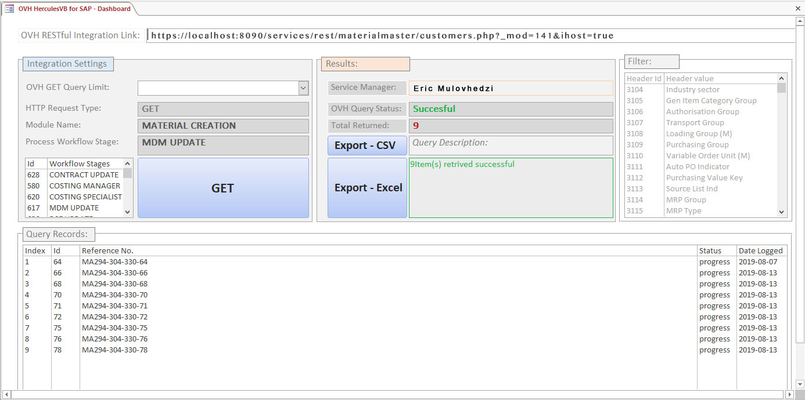

**OVH Master Data Application Integrator**
===
A low-code Visual Basics tool that serves as an application integration layer between morden cloud master data service components and existing legacy software platforms.

OVH Master Data Exchange is a client-server application integration tool used to provide a bidirectional interactive RESTful API communication to and fro morden cloud master data platforms and existing legacy software platforms.

It provides a low code designer for integrating service components that make up critical business applications, so you can have a single enterprise view and leverage all the monitoring and management capabilities that you rely on to run your business.

Spider Black, as a software development corporation, have been developing enterprise software for more than 25 years.

How to use
===
The visual basics code for different functions is within the Microsoft Access Database file ".accdb".

One needs to run it on a windows computer or laptop that has Microsof Office package that has Microsoft Access database within the package in order to run it.

**Updated last**
===
05 Sep 2022, version: 1.0
